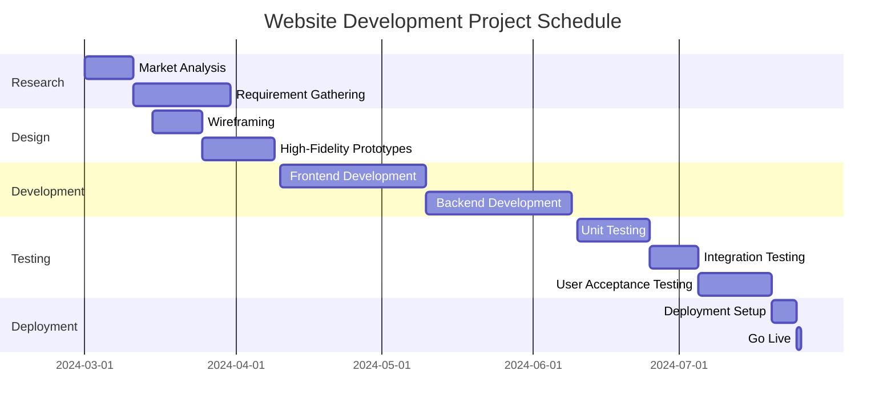

# My Diagram

```mermaid
gantt
    dateFormat  YYYY-MM-DD
    title       Website Development Project Schedule

    section Research
    Market Analysis            :a1, 2024-03-01, 10d
    Requirement Gathering      :after a1  , 20d
    
    section Design
    Wireframing                :2024-03-15, 10d
    High-Fidelity Prototypes   :2024-03-25, 15d
    
    section Development
    Frontend Development       :2024-04-10, 30d
    Backend Development        :2024-05-10, 30d
    
    section Testing
    Unit Testing               :2024-06-10, 15d
    Integration Testing        :2024-06-25, 10d
    User Acceptance Testing    :2024-07-05, 15d
    
    section Deployment
    Deployment Setup           :2024-07-20, 5d
    Go Live                    :2024-07-25, 1d

```